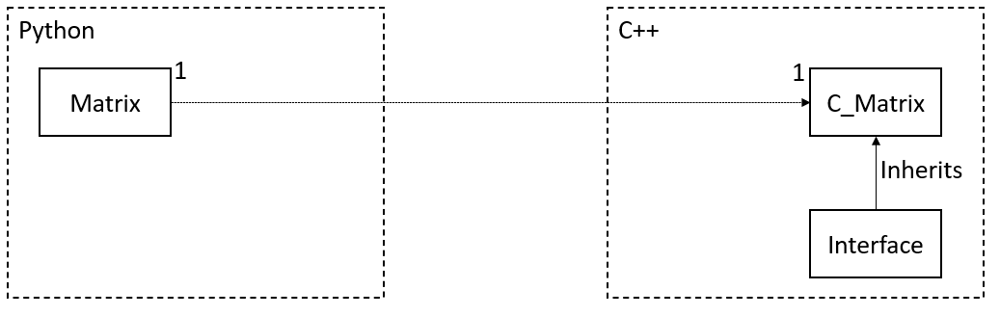

# Readme

Your task is to implemnt a simple matrix class in using Python. The 
implementaion of that class needs to be `matrix.py`. A matrix needs to be 
construced from nested `list` objects. Additionally it needs to support 
elementwise addtion, elementwise multiplication, identiy comparison,
and matrix multiplication. Using the resulting code should look like this:

```
A = Matrix([[1, 2, 3], [4, 5, 6], [7, 8, 9]])
B = Matrix([[9, 8, 7], [6, 5, 4], [3, 2, 1]])

C = A + B
```

However, when a Matrix object is created in Python a corresponding object in C++
needs to be created as well. The C++ object needs access to the values that make
up the matrix. The arithmetic operations (addition, multiplication, matrix 
multiplication) also need to be performed in C++.

On C++ side, there exists the classes `Interface` and `C_Matrix` (declared in 
the files `interface.h` and `c_matrix.h`). In your implementation, you need to 
implement the class `C_Matrix`. You can create additional classes and functions 
as you need, but you can not makes changes to `interface.h`. 

The code that connects the Python and C++ objects needs to use `ctypes`. Besides
the constructor you should only call functions on `C_Matrix` instances that
the functions declared in `Interface`. The implemenation of the arithemtic 
functions should ideally be multi-threaded.

A possible flow of data could look as follows: 
```
In python:
  A = Matrix([[1, 2, 3], [4, 5, 6], [7, 8, 9]]

  The Matrix constuctor calls a ctypes function that creats a C_Matrix instance.

In C++:
  The functions called by cytpes reads the matrix values and creates a new 
  C_Matrix instance.

You need come up with a meachnism to connect the Python and C++ objects.


In python: 
  B = A + A

  Calls the + operator of Matrix, which forwards using cytpes

In C++:
  Identifiy the two C_Matrix involved in the operation and return a new C_Matrix
  instance
```

You need to submit your source coude along with a build file that compiles the 
C++ code.

To summarize, your tasks are:
  - Create a Python class matrix that is backed by C++ objects. 
  - The connection between  Python and C++ needs to be done using `ctypes`.
  - Addition, multiplication, and matrix multiplication need to be done in
    C++; ideally using multithreading. 
  - Addition, multiplication, and matrix multiplication need to use the API 
    specified by `Interface`


Iportant Notes:
 - You are not allowed to use other modules than `ctypes`.
 - You are not allowed to use libraries that are not in C++ standart library.
 - You can view matrices as immutable. 
 - You only need to support element-wise operations for matrices of the same 
   dimension



